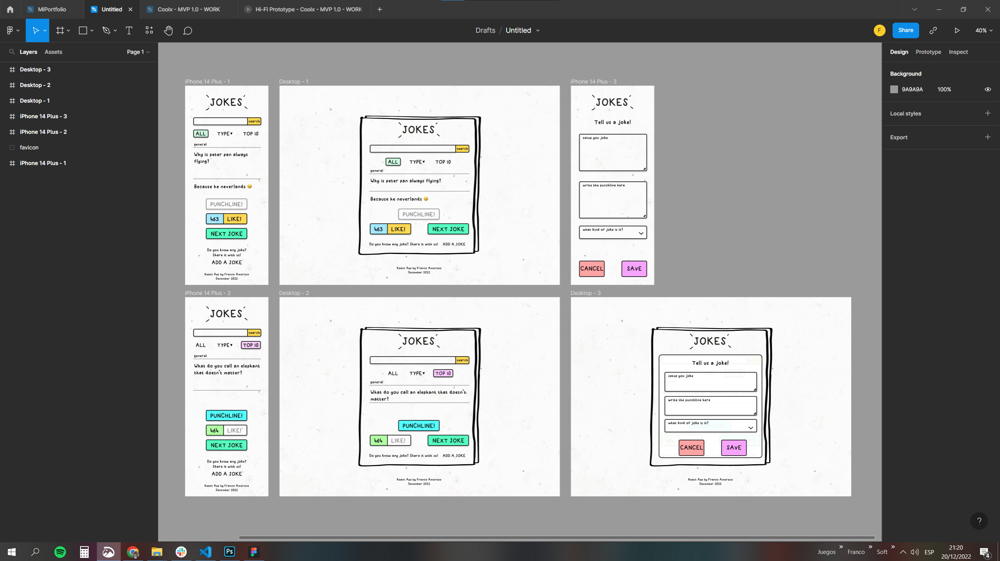
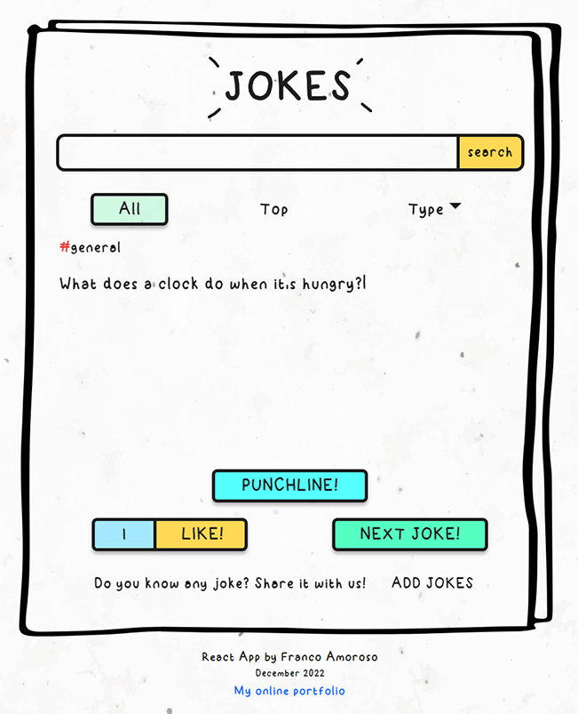
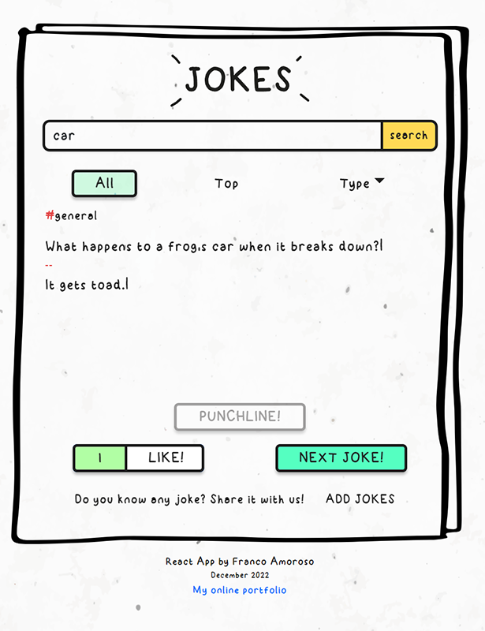
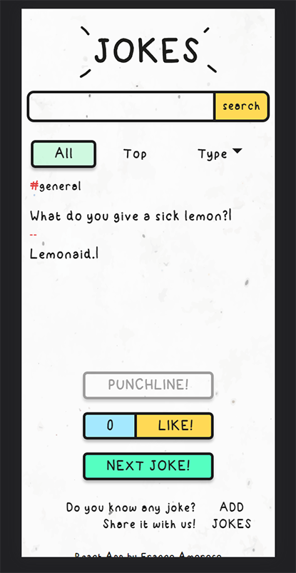
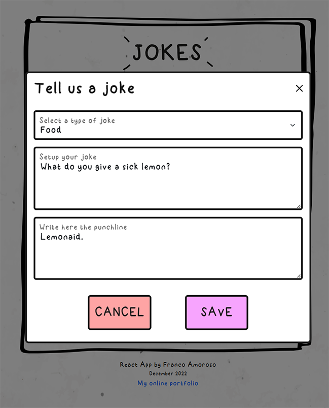

# JokesAPI
> A React.js app with hundreds of random jokes. 
> Video demo in [_Youtube_](https://youtu.be/ROJoLYIi0ZA).

## Table of Contents
* [General Info](#general-information)
* [Technologies Used](#technologies-used)
* [Features](#features)
* [Screen sizes tested](#screen-sizes-tested)
* [Screenshots](#screenshots)
* [Setup](#setup)
* [Contact](#contact)

## General Information
- You can find many jokes in this app. 
- You can rank the jokes you like the most.
- You can upload as many jokes as you want.

## Technologies Used
- Front-end: React.js - SASS - Bootstrap - JavaScript - Axios
- Back-end: Node.js - Express 
- Database: MySQL

## Features
- Random jokes.
- Filter by categories or rank.
- Search for keywords.
- Likes.
- Full responsive.
- Original design.

## Screen sizes tested
- 1920x1080 - 1440x900 - 1366x768 - 1280x800 - 1024x600 - 600x1024 - 800x1280 - 720x1280 - 820x1180 - 768x1024 - 912x1368
- 390x844 - 360x640 - 375x667 - 414x896 - 393x851 - 360x740 - 412x915 - 600x1024

## Screenshots

 
 

 
 

 
 

 
 

## Setup
1- Create the database with the file jokesapi.sql.
 
 
2- Copy the file .env provided in '/server' and set your database USER and PASS. 
 
 
3- Open your terminal and go to the '/server' folder and type 'npm install' to install the dependencies from the package.json. 
 
 
4- Run the server by typing 'npm start'.
 
 
5- Go to the '/client' folder and repeat 'npm install' followed by 'npm start'. The app will be open automatically in your browser.
 
 
6- Enjoy and have fun!

## Contact
Created by [Franco Amoroso](https://www.linkedin.com/in/francoamoroso/) - feel free to contact me!
 
Take a look at my new [Web Portfolio](https://www.franamoroso.com/). 
